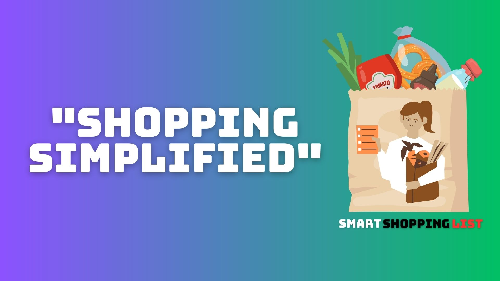

# Smart Shopping List

# Smart Shopping List is a Flutter-based mobile application designed to simplify and enhance your grocery shopping experience. This app allows users to discover recipes and create categorized shopping lists based on shopping items.

# Cross platform programming in Flutter makes this application available for Android, IOS, Chrome, MacOS and Winodws

#Features

- **Recipe Discovery:** Explore a variety of recipes and add ingredients to your shopping list.
- **Dynamic Shopping Lists:** Automatically generate and sort shopping lists based on chosen recipes.
- **Categorized Items:** Items in your shopping list are sorted by categories for efficient shopping.
- **Intuitive Interface:** A user-friendly interface for easy navigation and usage.
- **Offline Mode:** Access your shopping lists even when offline.

# Screenshots

*Caption: 
Explore recipes and add ingredients to your shopping list. And create Shopping list with categorized items for an organized shopping experience*

## Download the App

You can download and install the Smart Shopping List app on your Android device from the Google Play Store. It is developed for ios but not released on App Store yet!

Download here! **Not latest version**(https://play.google.com/store/apps/details?id=com.JKWSolutions.listapp&pli=1)

Hope you enjoy Smart Shopping List!
